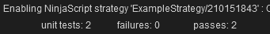

# NinjaTrader8_UnitTests
## Experiment to devise a means to unit test NinjaScript 
(For more info on NinjaScript, please see https://ninjatrader.com/support/helpGuides/nt8/en-us/ninjascript.htm)

NinjaTrader (https://ninjatrader.com/Build) is an excellent platform for coding algorithmic strategies for backtesting, or trading.

For algo developers using NinjaTrader, though, there aren't any off-the-shelf tools available that make it easy to follow Test Driven Development coding methodologies ( https://en.wikipedia.org/wiki/Test-driven_development ). Tools like say MSTest cannot be used.

**This repository is an attempt to explore an approach to unit testing NinjaScript so that better quality NinjaScript code can be written** (i.e. "better quality" here means better test coverage, easier to refactor, easier to regression test, etc.). 

The idea is to run the NinjaScript code under development on a chart so that the OnBarUpdate method can be used to call and run "test code".

Please see the attached code samples and ping me if it is not obvious what I am trying to do... please reach me via github, or send a message to AnotherTrader on the NinjaTrader forum ( https://ninjatrader.com/support/forum/ ).

All comments and feedback welcome.

Thanks!

Ben

NB - please see also the following forum post: https://ninjatrader.com/support/forum/forum/ninjatrader-8/add-on-development/1035646-unit-testing
